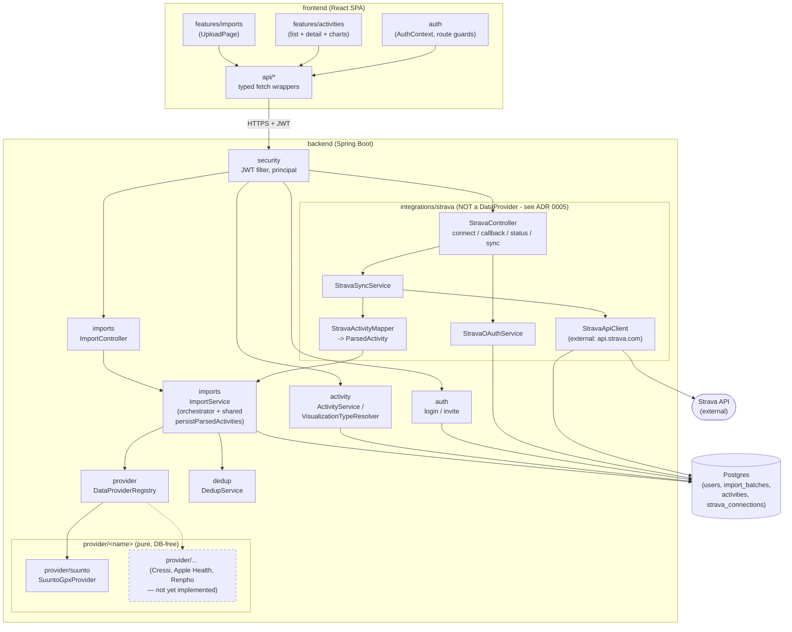
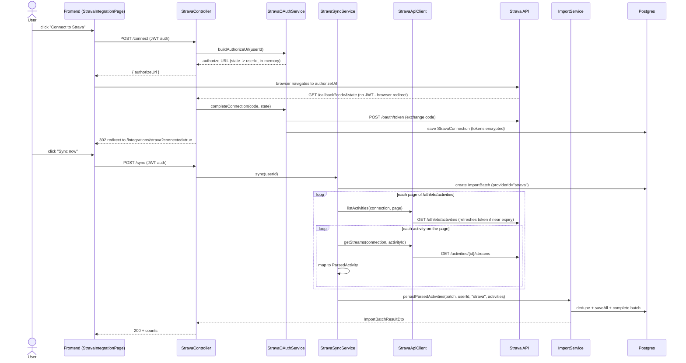
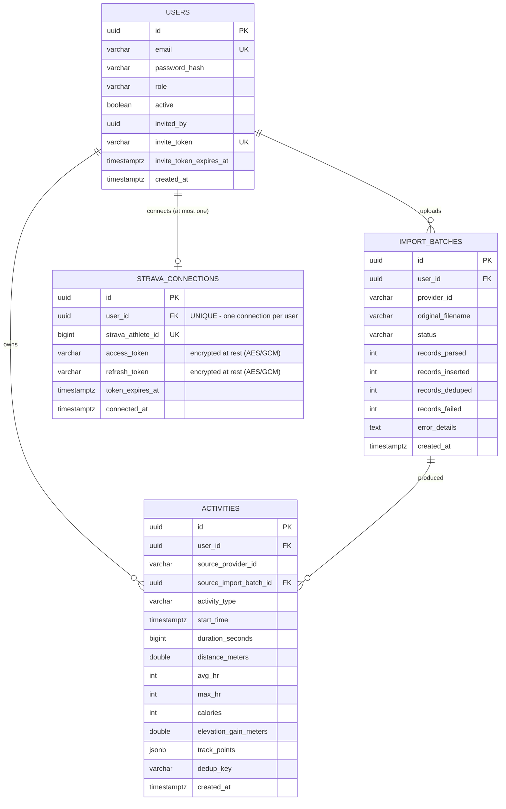
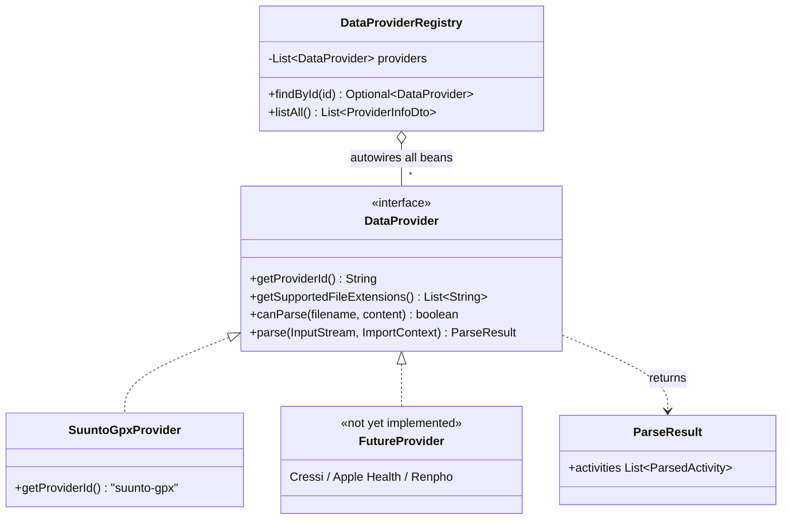
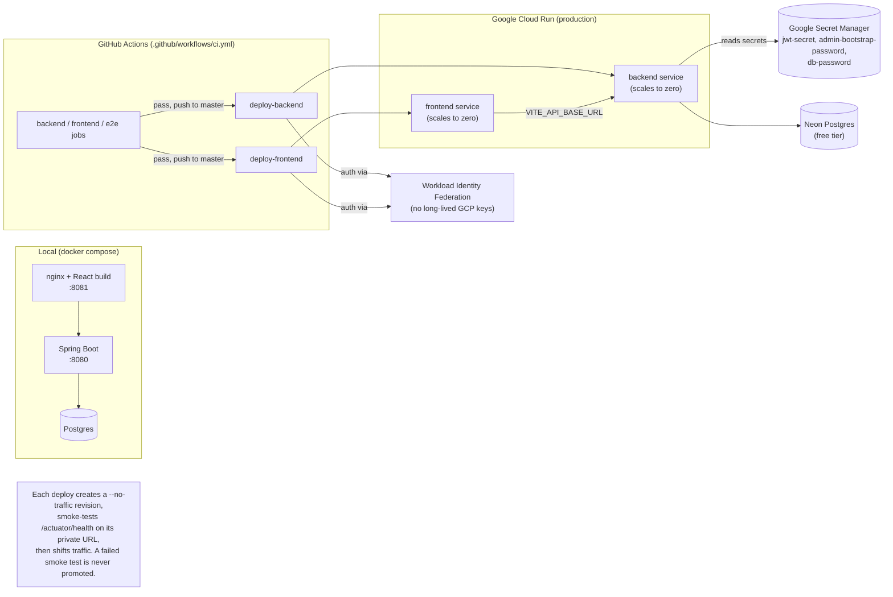

# Architecture diagrams

High-level, always-current diagrams of the system. These are generated from — and must stay in sync
with — the actual code; see the "Keeping this file current" note at the bottom for the rule that
enforces that. For *why* key decisions were made, see [`docs/adr/`](adr/); for the module-by-module
guide to extending the codebase, see [`../CLAUDE.md`](../CLAUDE.md).

## 1. Component overview

How the pieces fit together at runtime. Providers are isolated plugins; nothing outside
`ImportService` is allowed to depend on a specific provider.



## 2. Import flow (upload → stored activity)

The core end-to-end sequence, spanning `ImportController` → `ImportService` (see
`backend/src/main/java/com/mysportsapp/imports/ImportService.java`) → the selected provider → dedup →
persistence.

```mermaid
sequenceDiagram
    actor U as User
    participant FE as Frontend (UploadPage)
    participant IC as ImportController
    participant IS as ImportService
    participant PR as DataProviderRegistry
    participant DP as DataProvider (e.g. SuuntoGpxProvider)
    participant DD as DedupService
    participant DB as Postgres

    U->>FE: pick provider + file, submit
    FE->>IC: POST /api/v1/imports (multipart)
    IC->>IS: importFile(providerId, filename, bytes)
    IS->>DB: insert ImportBatch (status=PENDING)
    IS->>PR: findById(providerId)
    PR-->>IS: DataProvider bean
    IS->>DP: parse(inputStream, ImportContext)
    alt file unparsable
        DP-->>IS: throws ProviderParseException
        IS->>DB: ImportBatch.complete(FAILED)
        IS-->>IC: Outcome(hardParseFailure=true)
        IC-->>FE: 422 Unprocessable Entity
    else parsed OK
        DP-->>IS: ParseResult (List&lt;ParsedActivity&gt;)
        IS->>DD: split(userId, parsedActivities)
        DD->>DB: look up existing dedup_keys for user
        DD-->>IS: DedupResult (new vs. duplicate)
        IS->>DB: saveAll(new Activity rows)
        IS->>DB: ImportBatch.complete(SUCCESS/PARTIAL)
        IS-->>IC: Outcome(result)
        IC-->>FE: 200 + counts (parsed/inserted/deduped)
    end
    FE-->>U: show result, then list refreshes via Activities API
```

## 2b. Strava sync flow (Phase 1 — on-demand, not continuous)

No file, no `DataProvider` — see [ADR 0005](adr/0005-strava-integration-not-a-dataprovider.md). Connect
is a one-time OAuth handshake; Sync can be triggered on demand as often as the user likes, reusing the
same dedup/persist path a GPX upload uses via `ImportService.persistParsedActivities`.



## 3. Data model

Every tenant-owned table carries `user_id` and is only ever queried scoped to it — see
[`../CLAUDE.md`](../CLAUDE.md) principle 2 and `TenantScopingArchTest`. Reflects the current Flyway
migrations (`V1`–`V4`).



`(user_id, dedup_key)` is unique on `activities` — that constraint, not application logic alone, is
the final backstop against double-importing the same record (see
[`adr/0004-jsonb-track-storage.md`](adr/0004-jsonb-track-storage.md) for why raw track data is stored
as JSONB rather than a normalized table).

## 4. Provider plugin pattern

Adding a provider means implementing one interface and annotating it `@Component` — see "Recipe: adding
a new data provider" in [`../CLAUDE.md`](../CLAUDE.md). No other class is touched.

This pattern is specifically for *file-based* sources. Strava sync (§2b) deliberately isn't a
`DataProvider` — there's no file, just two API calls — see
[ADR 0005](adr/0005-strava-integration-not-a-dataprovider.md). It produces the same `ParsedActivity`
DTOs a provider would and feeds them into the same shared `ImportService.persistParsedActivities`, so
the diagram below is still the right mental model for "how does a new activity type get in" even though
Strava itself sits outside it.



## 5. Deployment topology

Local development uses Docker Compose end to end; production is Google Cloud Run + Neon Postgres,
deployed automatically by GitHub Actions on every merge to `master`. Full one-time setup:
[`deployment.md`](deployment.md).



## Keeping this file current

These diagrams are documentation, not generated artifacts — there is no build step that regenerates
them, so they only stay accurate if they're updated by hand alongside the code. The rule for that
lives in [`../CLAUDE.md`](../CLAUDE.md) under "Documentation maintenance": any change to a module
boundary, the data model, the deploy topology, or a core flow (import, auth) must update the relevant
diagram here in the same change.
